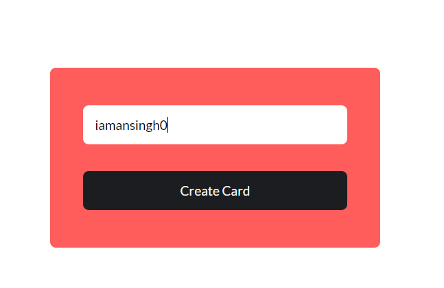

# gitCard-BunJS

To install dependencies:

```bash
bun install
```

To run:

```bash
bun run build
```

Open the index.html as live server

This project was created using `bun init` in bun v1.0.3. [Bun](https://bun.sh) is a fast all-in-one JavaScript runtime.

deployed: [link](https://gitcard-mu.vercel.app/)

<p align=center>
  
</p>
<p align=center>
  
</p>

Design Credits: [https://codepen.io/RocktimSaikia/full/jObbBmR](https://codepen.io/RocktimSaikia/full/jObbBmR)
